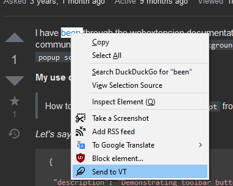
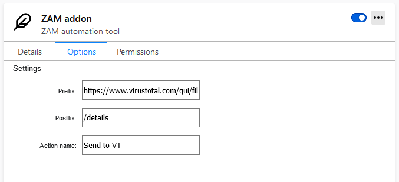
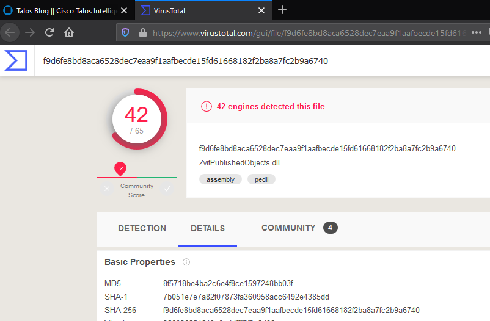

# FirefoxExtentions
Repository with FF webextentions, developed to simplify daily routine

## ZAM
ZAM is kind of compilation of extenrions below. It allows you to add your own right-click selection menu, which will then send selected text to URL of your choise. 
The idea here is to use it with Flask to automate things with Python backend.

URL = prefix + selection + postix

You can set prefix & postfix in addon's options page. 

## Check on VirusTotal
https://addons.mozilla.org/addon/check-on-virustotal/
Small extention which opens VT search tab with details on selected text (hash).

### How to use
1. double click hash string
2. Right click -> "Check on VirusTotal"
3. new tab should be opened at the ackground with search results

## Open-in-Umbrella
this extension will add new option to FF context menu: "Search domain in Umbrella". Will simplify your daily routine with Cisco Umbrella tool
### How to install
Download FF developers edition. It allows you to install addons from file.
1. get it here https://www.mozilla.org/ru/firefox/channel/desktop/ 
2. open tab "about:config" and set parameter *xpinstall.signatures.required* to false
3. prepare the addon:
a. get your Umbrella client ID and put it in the background.js file instead of <client_id>
b. get your API key from Umbrella dashboad. Do base64 for secret and key to have a single token.
c. Get FF addon "Modify Header Value" https://mybrowseraddon.com/modify-header-value.html
d. set API key is addon settings: URL https://reports.api.umbrella.com/. Header: Authorization. Value: Basic <your_token>
4. Donwload my addon files and zip them
5. Install zip file via about:addons. Click settings icon in top right conner and choose "install from file"

addon is super stupid. You need to carefully select only domain name, right click and select "search umbrella".
So if you have URL like https://google.com/searchblablabla make sure that you have selected only "google.com"

# Links
your addons https://addons.mozilla.org/en-US/developers/addons
